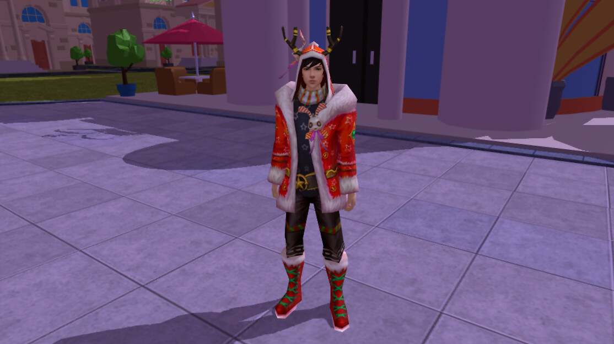

# System 5 : Appearance

Every player will have a unique avatar in the world of OurGame. Avatars can be primitive early on, but over time the avatars become highly specialized. Players can freely change their avatars by wearing costume skins.

## Mechanism

* Players synthesize skins by collecting skin materials and consuming a certain amount of $TT tokens;
* The appearance is the same as the equipment, it will give combat attributes, and the appearance can provide the player with a health percentage bonus;
* Players can instantly change the character image in the game by wearing the skin
